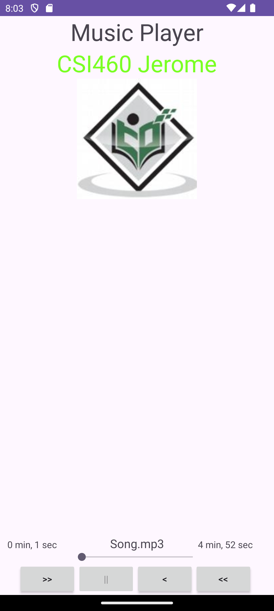

# Audio Player 

This is an Android Audio Player. You can play, pause, and skip forward and backward for the song being played.

## Features 

- Shows the time left in the song
- Seekbar to show the position in the song
- Play/Pause Buttons
- Skip Forward and Back 5 seconds

## How to Run:

1. Copy the URL
2. Open Android Studio
3. Click on the top left of the application where your current project name is
4. Click "Get from version control"
5. In "Repository URL," Past the URL and choose the directory to clone the project
6. Application should load up, and now you can run the app on your virtual device
